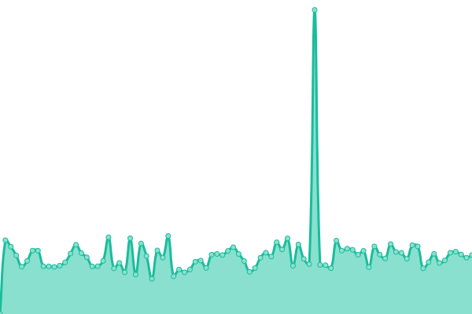
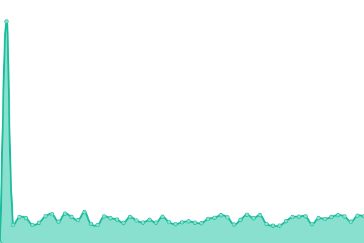
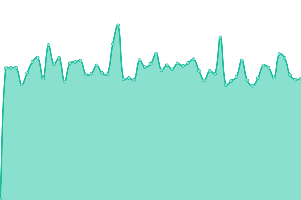
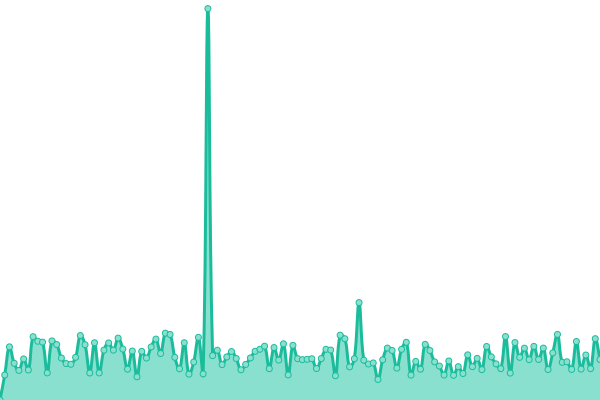

# [📈 Live Status](https://gfxpronet.github.io/upptime): <!--live status--> **🟧 Partial outage**

This repository contains the open-source uptime monitor and status page for [GFX | Productions™](https://gfx-pro.net), powered by [Upptime](https://github.com/upptime/upptime).

With [Upptime](https://upptime.js.org), you can get your own unlimited and free uptime monitor and status page, powered entirely by a GitHub repository. We use [Issues](https://github.com/gfxpronet/upptime/issues) as incident reports, [Actions](https://github.com/gfxpronet/upptime/actions) as uptime monitors, and [Pages](https://gfxpronet.github.io/upptime) for the status page.

<!--start: status pages-->
<!-- This summary is generated by Upptime (https://github.com/upptime/upptime) -->
<!-- Do not edit this manually, your changes will be overwritten -->
<!-- prettier-ignore -->
| URL | Status | History | Response Time | Uptime |
| --- | ------ | ------- | ------------- | ------ |
|  [GFX Productions™](https://gfx-pro.net) | 🟩 Up | [gfx-productions.yml](https://github.com/gfxpronet/upptime/commits/HEAD/history/gfx-productions.yml) | 

 588ms
     
 | 

<a href="https://gfxpronet.github.io/upptime/history/gfx-productions">97.74%</a>
    

|  [GFX Productions™ API](https://api.gfx-pro.net) | 🟥 Down | [gfx-productions-api.yml](https://github.com/gfxpronet/upptime/commits/HEAD/history/gfx-productions-api.yml) | 

 390ms
     
 | 

<a href="https://gfxpronet.github.io/upptime/history/gfx-productions-api">0.00%</a>
    

|  [GFX Productions™ CDN](http://gfxpronet.byethost3.com) | 🟩 Up | [gfx-productions-cdn.yml](https://github.com/gfxpronet/upptime/commits/HEAD/history/gfx-productions-cdn.yml) | 

 1875ms
     
 | 

<a href="https://gfxpronet.github.io/upptime/history/gfx-productions-cdn">97.94%</a>
    

|  [GFX Productions™ IDE](https://code.gfx-pro.net) | 🟩 Up | [gfx-productions-ide.yml](https://github.com/gfxpronet/upptime/commits/HEAD/history/gfx-productions-ide.yml) | 

 576ms
     
 | 

<a href="https://gfxpronet.github.io/upptime/history/gfx-productions-ide">100.00%</a>
    

|  [GFX Productions™ NAS](https://nas.gfx-pro.net) | 🟩 Up | [gfx-productions-nas.yml](https://github.com/gfxpronet/upptime/commits/HEAD/history/gfx-productions-nas.yml) | 

 1291ms
     
 | 

<a href="https://gfxpronet.github.io/upptime/history/gfx-productions-nas">100.00%</a>
    

|  [MediaKiller™](https://mk.gfx-pro.net) | 🟥 Down | [media-killer.yml](https://github.com/gfxpronet/upptime/commits/HEAD/history/media-killer.yml) | 

 0ms
     
 | 

<a href="https://gfxpronet.github.io/upptime/history/media-killer">0.00%</a>
    

|  [Mindful Planner](https://mindfulplanner.nl) | 🟩 Up | [mindful-planner.yml](https://github.com/gfxpronet/upptime/commits/HEAD/history/mindful-planner.yml) | 

 550ms
     
 | 

<a href="https://gfxpronet.github.io/upptime/history/mindful-planner">97.94%</a>
    

|  [PlayMusic™](https://music.gfxp.ro) | 🟥 Down | [play-music.yml](https://github.com/gfxpronet/upptime/commits/HEAD/history/play-music.yml) | 

 0ms
     
 | 

<a href="https://gfxpronet.github.io/upptime/history/play-music">0.00%</a>
    

|  [Pokémon GO Shiny Hunt](https://api.gfx-pro.net/assets/shinyHunt/v2/) | 🟥 Down | [pokemon-go-shiny-hunt.yml](https://github.com/gfxpronet/upptime/commits/HEAD/history/pokemon-go-shiny-hunt.yml) | 

 307ms
     
 | 

<a href="https://gfxpronet.github.io/upptime/history/pokemon-go-shiny-hunt">0.00%</a>
    

|  [Pokémon GO Shiny Rates](https://nas.gfx-pro.net/shiny/rates) | 🟩 Up | [pokemon-go-shiny-rates.yml](https://github.com/gfxpronet/upptime/commits/HEAD/history/pokemon-go-shiny-rates.yml) | 

 1888ms
     
 | 

<a href="https://gfxpronet.github.io/upptime/history/pokemon-go-shiny-rates">100.00%</a>
    

|  [Redirected by GPN™](https://gfxp.ro) | 🟩 Up | [redirected-by-gpn.yml](https://github.com/gfxpronet/upptime/commits/HEAD/history/redirected-by-gpn.yml) | 

 596ms
     
 | 

<a href="https://gfxpronet.github.io/upptime/history/redirected-by-gpn">97.94%</a>
    

|  [RGB24/BGR15 Converter](https://nas.gfx-pro.net/BGR15) | 🟥 Down | [rgb-24-bgr-15-converter.yml](https://github.com/gfxpronet/upptime/commits/HEAD/history/rgb-24-bgr-15-converter.yml) | 

 430ms
     
 | 

<a href="https://gfxpronet.github.io/upptime/history/rgb-24-bgr-15-converter">0.00%</a>
    

<!--end: status pages-->

[**Visit our status website →**](https://gfxpronet.github.io/upptime)

## 📄 License

- Powered by: [Upptime](https://github.com/upptime/upptime)
- Code: [MIT](./LICENSE) © [GFX | Productions™](https://gfx-pro.net)
- Data in the `./history` directory: [Open Database License](https://opendatacommons.org/licenses/odbl/1-0/)
