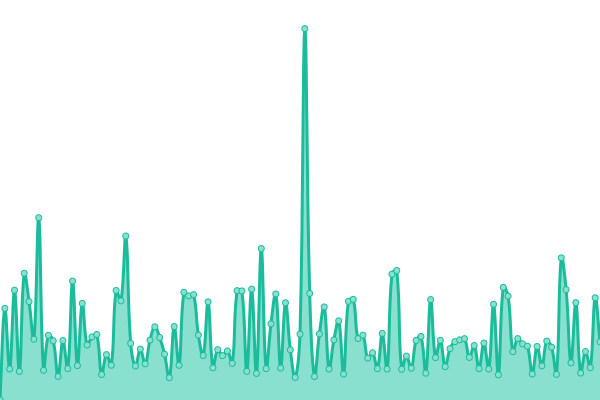
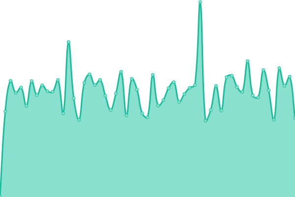
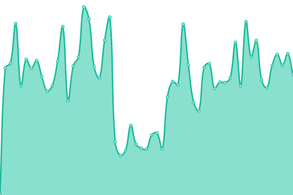
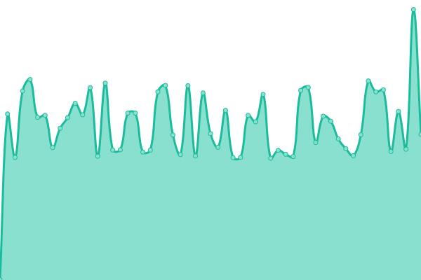
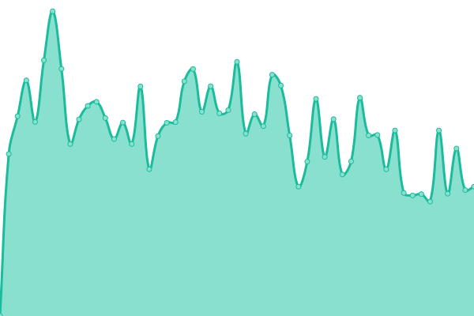
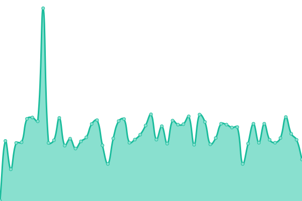
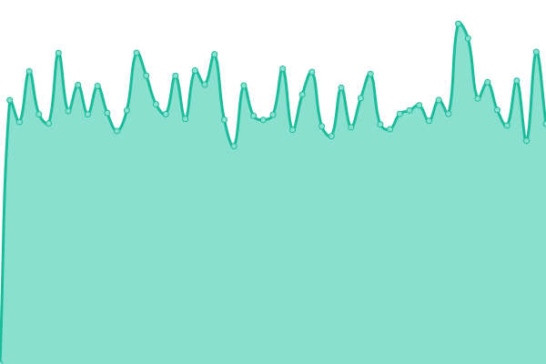
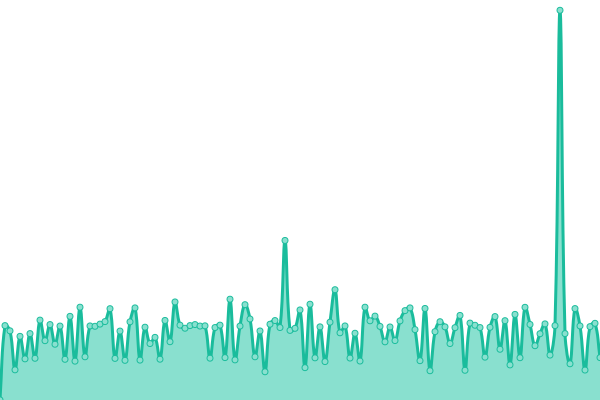
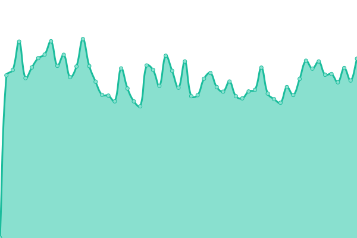

# [📈 Live Status](https://gfxpronet.github.io/upptime): <!--live status--> **🟧 Partial outage**

This repository contains the open-source uptime monitor and status page for [GFX | Productions™](https://gfx-pro.net), powered by [Upptime](https://github.com/upptime/upptime).

With [Upptime](https://upptime.js.org), you can get your own unlimited and free uptime monitor and status page, powered entirely by a GitHub repository. We use [Issues](https://github.com/gfxpronet/upptime/issues) as incident reports, [Actions](https://github.com/gfxpronet/upptime/actions) as uptime monitors, and [Pages](https://gfxpronet.github.io/upptime) for the status page.

<!--start: status pages-->
<!-- This summary is generated by Upptime (https://github.com/upptime/upptime) -->
<!-- Do not edit this manually, your changes will be overwritten -->
<!-- prettier-ignore -->
| URL | Status | History | Response Time | Uptime |
| --- | ------ | ------- | ------------- | ------ |
|  [GFX Productions™](https://gfx-pro.net) | 🟩 Up | [gfx-productions.yml](https://github.com/gfxpronet/upptime/commits/HEAD/history/gfx-productions.yml) | 

 633ms
     
 | 

<a href="https://gfxpronet.github.io/upptime/history/gfx-productions">100.00%</a>
    

|  [GFX Productions™ API](https://api.gfx-pro.net) | 🟥 Down | [gfx-productions-api.yml](https://github.com/gfxpronet/upptime/commits/HEAD/history/gfx-productions-api.yml) | 

 322ms
     
 | 

<a href="https://gfxpronet.github.io/upptime/history/gfx-productions-api">100.00%</a>
    

|  [MediaKiller™](https://mk.gfx-pro.net) | 🟩 Up | [media-killer.yml](https://github.com/gfxpronet/upptime/commits/HEAD/history/media-killer.yml) | 

 936ms
     
 | 

<a href="https://gfxpronet.github.io/upptime/history/media-killer">100.00%</a>
    

|  [PlayMusic™](https://music.gfxp.ro) | 🟩 Up | [play-music.yml](https://github.com/gfxpronet/upptime/commits/HEAD/history/play-music.yml) | 

 822ms
     
 | 

<a href="https://gfxpronet.github.io/upptime/history/play-music">100.00%</a>
    

|  [Pokémon GO Profiles](https://pgo.gfxp.ro) | 🟩 Up | [pokemon-go-profiles.yml](https://github.com/gfxpronet/upptime/commits/HEAD/history/pokemon-go-profiles.yml) | 

 468ms
     
 | 

<a href="https://gfxpronet.github.io/upptime/history/pokemon-go-profiles">99.82%</a>
    

|  [Pokémon GO Shiny Hunt](https://api.gfx-pro.net/assets/shinyHunt/v2/) | 🟥 Down | [pokemon-go-shiny-hunt.yml](https://github.com/gfxpronet/upptime/commits/HEAD/history/pokemon-go-shiny-hunt.yml) | 

 138ms
     
 | 

<a href="https://gfxpronet.github.io/upptime/history/pokemon-go-shiny-hunt">99.99%</a>
    

|  [Pokémon GO Shiny Rates](https://api.gfx-pro.net/assets/shinyRates) | 🟥 Down | [pokemon-go-shiny-rates.yml](https://github.com/gfxpronet/upptime/commits/HEAD/history/pokemon-go-shiny-rates.yml) | 

 1118ms
     
 | 

<a href="https://gfxpronet.github.io/upptime/history/pokemon-go-shiny-rates">99.99%</a>
    

|  [Redirected by GPN™](https://gfxp.ro) | 🟩 Up | [redirected-by-gpn.yml](https://github.com/gfxpronet/upptime/commits/HEAD/history/redirected-by-gpn.yml) | 

 383ms
     
 | 

<a href="https://gfxpronet.github.io/upptime/history/redirected-by-gpn">100.00%</a>
    

|  [RGB24/BGR15 Converter](https://api.gfx-pro.net/assets/BGR15) | 🟥 Down | [rgb-24-bgr-15-converter.yml](https://github.com/gfxpronet/upptime/commits/HEAD/history/rgb-24-bgr-15-converter.yml) | 

 129ms
     
 | 

<a href="https://gfxpronet.github.io/upptime/history/rgb-24-bgr-15-converter">99.98%</a>
    

<!--end: status pages-->

[**Visit our status website →**](https://gfxpronet.github.io/upptime)

## 📄 License

- Powered by: [Upptime](https://github.com/upptime/upptime)
- Code: [MIT](./LICENSE) © [GFX | Productions™](https://gfx-pro.net)
- Data in the `./history` directory: [Open Database License](https://opendatacommons.org/licenses/odbl/1-0/)
