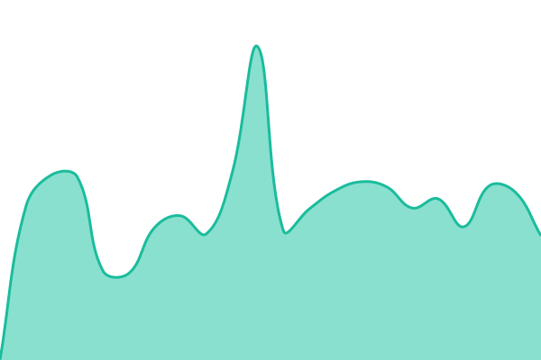
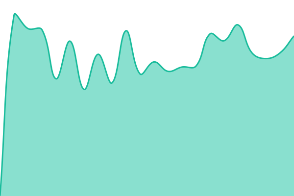
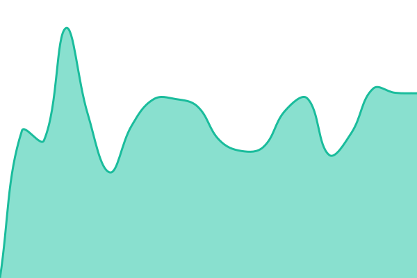
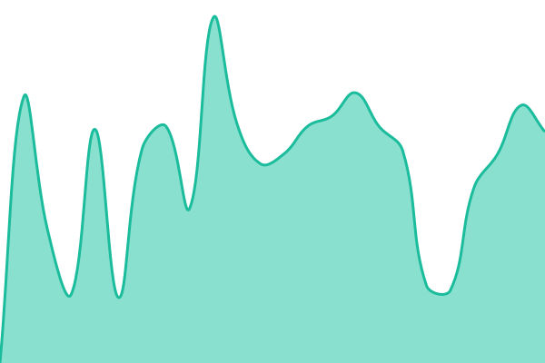
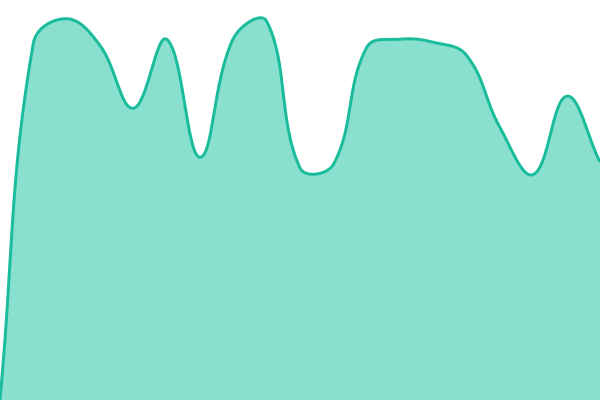
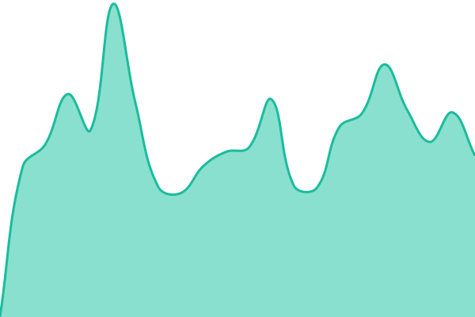
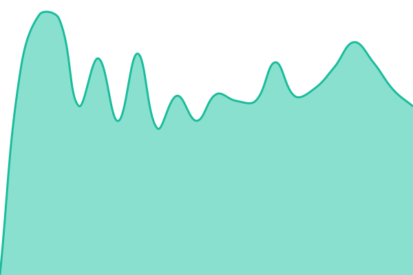
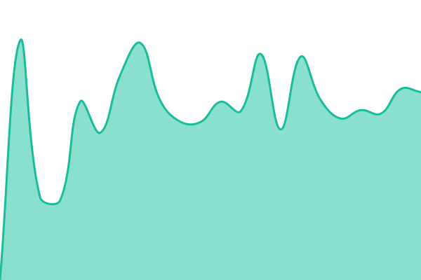
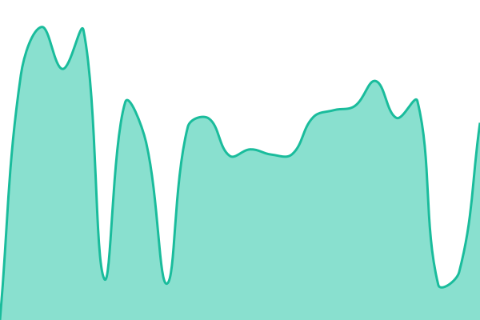

# [📈 Live Status](https://gfxpronet.github.io/upptime): <!--live status--> **🟩 All systems operational**

This repository contains the open-source uptime monitor and status page for [GFX | Productions™](https://gfx-pro.net), powered by [Upptime](https://github.com/upptime/upptime).

With [Upptime](https://upptime.js.org), you can get your own unlimited and free uptime monitor and status page, powered entirely by a GitHub repository. We use [Issues](https://github.com/gfxpronet/upptime/issues) as incident reports, [Actions](https://github.com/gfxpronet/upptime/actions) as uptime monitors, and [Pages](https://gfxpronet.github.io/upptime) for the status page.

<!--start: status pages-->
<!-- This summary is generated by Upptime (https://github.com/upptime/upptime) -->
<!-- Do not edit this manually, your changes will be overwritten -->
<!-- prettier-ignore -->
| URL | Status | History | Response Time | Uptime |
| --- | ------ | ------- | ------------- | ------ |
|  [GPN™ Website](https://gfx-pro.net) | 🟩 Up | [gpn-website.yml](https://github.com/gfxpronet/upptime/commits/HEAD/history/gpn-website.yml) | 

 607ms
     
 | 

<a href="https://gfxpronet.github.io/upptime/history/gpn-website">100.00%</a>
    

|  [GPN™ Accounts](https://accounts.gfx-pro.net) | 🟩 Up | [gpn-accounts.yml](https://github.com/gfxpronet/upptime/commits/HEAD/history/gpn-accounts.yml) | 

 769ms
     
 | 

<a href="https://gfxpronet.github.io/upptime/history/gpn-accounts">100.00%</a>
    

|  [GPN™ Mailing](https://mailing.gfx-pro.net) | 🟩 Up | [gpn-mailing.yml](https://github.com/gfxpronet/upptime/commits/HEAD/history/gpn-mailing.yml) | 

 881ms
     
 | 

<a href="https://gfxpronet.github.io/upptime/history/gpn-mailing">100.00%</a>
    

|  [GFX Productions™ NAS](https://nas.gfx-pro.net) | 🟩 Up | [gfx-productions-nas.yml](https://github.com/gfxpronet/upptime/commits/HEAD/history/gfx-productions-nas.yml) | 

 1309ms
     
 | 

<a href="https://gfxpronet.github.io/upptime/history/gfx-productions-nas">100.00%</a>
    

|  [GFX Productions™ IDE](https://code.gfx-pro.net) | 🟩 Up | [gfx-productions-ide.yml](https://github.com/gfxpronet/upptime/commits/HEAD/history/gfx-productions-ide.yml) | 

 1256ms
     
 | 

<a href="https://gfxpronet.github.io/upptime/history/gfx-productions-ide">100.00%</a>
    

|  [Mindful Planner](https://mindfulplanner.nl) | 🟩 Up | [mindful-planner.yml](https://github.com/gfxpronet/upptime/commits/HEAD/history/mindful-planner.yml) | 

 546ms
     
 | 

<a href="https://gfxpronet.github.io/upptime/history/mindful-planner">100.00%</a>
    

|  [Redirected by GPN™](https://gfxp.ro) | 🟩 Up | [redirected-by-gpn.yml](https://github.com/gfxpronet/upptime/commits/HEAD/history/redirected-by-gpn.yml) | 

 839ms
     
 | 

<a href="https://gfxpronet.github.io/upptime/history/redirected-by-gpn">100.00%</a>
    

|  [StreamPulse by GPN™](https://streampulse.gfx-pro.net) | 🟩 Up | [stream-pulse-by-gpn.yml](https://github.com/gfxpronet/upptime/commits/HEAD/history/stream-pulse-by-gpn.yml) | 

 785ms
     
 | 

<a href="https://gfxpronet.github.io/upptime/history/stream-pulse-by-gpn">100.00%</a>
    

|  [Shiny Rates](https://shiny.gfxp.ro) | 🟩 Up | [shiny-rates.yml](https://github.com/gfxpronet/upptime/commits/HEAD/history/shiny-rates.yml) | 

 2656ms
     
 | 

<a href="https://gfxpronet.github.io/upptime/history/shiny-rates">100.00%</a>
    

<!--end: status pages-->

[**Visit our status website →**](https://gfxpronet.github.io/upptime)

## 📄 License

- Powered by: [Upptime](https://github.com/upptime/upptime)
- Code: [MIT](./LICENSE) © [GFX | Productions™](https://gfx-pro.net)
- Data in the `./history` directory: [Open Database License](https://opendatacommons.org/licenses/odbl/1-0/)
